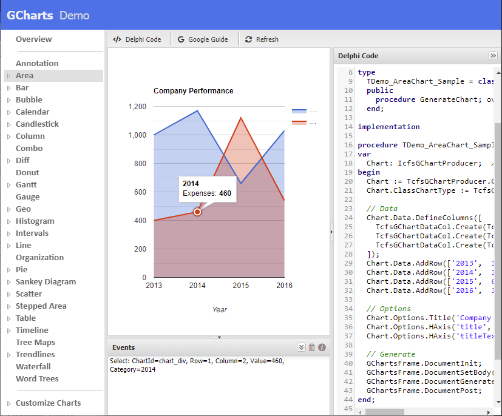
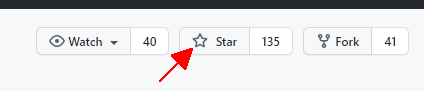

## Delphi-GCharts

Delphi-GCharts is a Delphi library of components to generate charts in uniGUI Framework using the Google Charts API. 


Currently it supports the following Google Chart classes:

- [Annotation](https://developers.google.com/chart/interactive/docs/gallery/annotationchart)
- [Area](https://developers.google.com/chart/interactive/docs/gallery/areachart)
- [Bar](https://developers.google.com/chart/interactive/docs/gallery/barchart)
- [Bubble](https://developers.google.com/chart/interactive/docs/gallery/bubblechart)
- [Calendar](https://developers.google.com/chart/interactive/docs/gallery/calendar)
- [Candlestick](https://developers.google.com/chart/interactive/docs/gallery/candlestickchart)
- [Column](https://developers.google.com/chart/interactive/docs/gallery/columnchart)
- [Combo](https://developers.google.com/chart/interactive/docs/gallery/combochart)
- [Diff](https://developers.google.com/chart/interactive/docs/gallery/diffchart)
- [Donut](https://developers.google.com/chart/interactive/docs/gallery/piechart#donut)
- [Gantt](https://developers.google.com/chart/interactive/docs/gallery/ganttchart)
- [Gauge](https://developers.google.com/chart/interactive/docs/gallery/gauge)
- [Geo](https://developers.google.com/chart/interactive/docs/gallery/geochart)
- [Histogram](https://developers.google.com/chart/interactive/docs/gallery/histogram)
- [Intervals](https://developers.google.com/chart/interactive/docs/gallery/intervals)
- [Line](https://developers.google.com/chart/interactive/docs/gallery/linechart)
- [Organization](https://developers.google.com/chart/interactive/docs/gallery/orgchart)
- [Pie](https://developers.google.com/chart/interactive/docs/gallery/piechart)
- [Sankey Diagram](https://developers.google.com/chart/interactive/docs/gallery/sankey)
- [Scatter](https://developers.google.com/chart/interactive/docs/gallery/scatterchart)
- [Stepped Area](https://developers.google.com/chart/interactive/docs/gallery/steppedareachart)
- [Table](https://developers.google.com/chart/interactive/docs/gallery/table)
- [Timeline](https://developers.google.com/chart/interactive/docs/gallery/timeline)
- [Tree Maps](https://developers.google.com/chart/interactive/docs/gallery/treemap)
- [Trendlines](https://developers.google.com/chart/interactive/docs/gallery/trendlines)
- [Waterfall](https://developers.google.com/chart/interactive/docs/gallery/candlestickchart#Waterfall)
- [Word Trees](https://developers.google.com/chart/interactive/docs/gallery/wordtree)


## Components

The library has two main components:

- **TcfsGChartProducer**(non visual): this component is responsible for generating the javascript code according to the data and options of the class chart to be generated.
- **TuniGChartsFrame**: this component is used to view and interact with the Chart produced by **TcfsGChartProducer**.


## Install

Delphi-GCharts has been coded and tested in Delphi `10.4 Sydney` with uniGUI Version: `1.90.0 build 1549`, but surely can be compiled into earlier or newer versions.

Install the visual component **cfs.Charts.uniGUI.dpk** that is in the **package** folder and also **add** to the **library search path** the **sources** folder.


## Basic Use Example

Basic example to generate this Pie Chart:


````Delphi
unit Main;

interface

uses
  Windows, Messages, SysUtils, Variants, Classes, Graphics,
  Controls, Forms, uniGUITypes, uniGUIAbstractClasses,
  uniGUIClasses, uniGUIRegClasses, uniGUIForm, uniGUIBaseClasses,
  cfs.GCharts.uniGUI;

type
  TMainForm = class(TUniForm)
    uniGChartsFrame1: TuniGChartsFrame;
    procedure UniFormCreate(Sender: TObject);
  private
  public
  end;

function MainForm: TMainForm;

implementation

{$R *.dfm}

uses
  uniGUIVars, MainModule, cfs.GCharts; // <--- Add this unit

function MainForm: TMainForm;
begin
  Result := TMainForm(UniMainModule.GetFormInstance(TMainForm));
end;

procedure TMainForm.UniFormCreate(Sender: TObject);
var
  Chart: IcfsGChartProducer; //Defined as TInterfacedObject. No need try..finally
begin
  Chart := TcfsGChartProducer.Create;
  Chart.ClassChartType := TcfsGChartProducer.CLASS_PIE_CHART;

  // Data
  Chart.Data.DefineColumns([
    TcfsGChartDataCol.Create(TcfsGChartDataType.gcdtString, 'Topping'),
    TcfsGChartDataCol.Create(TcfsGChartDataType.gcdtNumber, 'Slices')
  ]);
  Chart.Data.AddRow(['Mushrooms', 3]);
  Chart.Data.AddRow(['Onions', 1]);
  Chart.Data.AddRow(['Olives', 1]);
  Chart.Data.AddRow(['Zucchini', 1]);
  Chart.Data.AddRow(['Pepperoni', 2]);

  // Options
  Chart.Options.Title('How Much Pizza I Ate Last Night');

  // Generate
  uniGChartsFrame1.DocumentInit;
  uniGChartsFrame1.DocumentSetBody('<div id="Chart" style="width:100%;height:100%;"></div>');
  uniGChartsFrame1.DocumentGenerate('Chart', Chart);
  uniGChartsFrame1.DocumentPost;
end;


````


## Demo Application

The library includes in demos folder the **GChartsDemo** project with several examples that show how to build the different class charts.




When running the demo you can:

- Display the **Delphi Code** used to generate the Chart
- Click **Google Guide** button to see the official documentation of Google Charts.
- Click on the Chart  to see fired events


------

## Star this project



Please, if you use **Delphi GCharts**, "**Star**" this project in GitHub! 

It cost nothing to you but helps other developers to reference the code.


